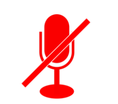
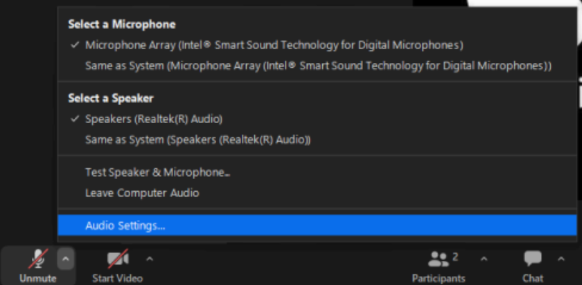
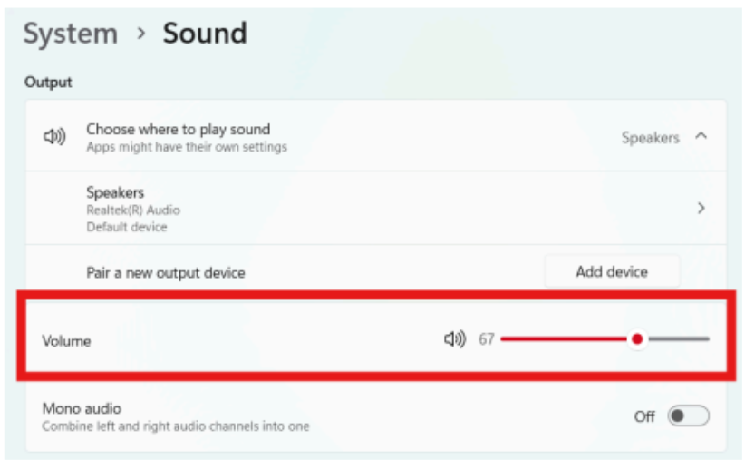

# Portfolio Submission: Enterprise Documentation Series

The following entry demonstrates my ability to structure technical documentation using a native Docs-as-Code Markdown layout, showcasing structured information architecture, clear taxonomy, and step-by-step technical formatting.

---

## SOP: Enterprise Zoom Audio Troubleshooting Guide

### Document Information
* **Target Audience:** General Users, Tier 1 Helpdesk, Tier 2 IT Support
* **Estimated Time:** 3–5 minutes
* **Difficulty:** Beginner to Intermediate
* **In Scope:** Zoom application audio settings, hardware layer cycling, Windows OS sound configuration.
* **Out of Scope:** Physical hardware repair, network bandwidth diagnostics, advanced driver reinstallation.

#### Prerequisites
Before starting this process, ensure:
1. Active Zoom desktop client is installed and running.
2. An audio hardware device (built-in speakers/microphone or external headset) is connected to your computer.
3. You have basic permissions to adjust system volume on your operating system.

---

### Overview
This guide provides step-by-step diagnostic procedures to identify and resolve active meeting audio drops or mute issues in Zoom.

### 1) Initial Diagnostic Workflow
After each attempt, test your audio before proceeding to the next troubleshooting step.
1. Check mute button status.
2. Verify selected audio source in Zoom.
3. Test physical hardware connection.
4. Verify system-wide volume settings.
5. If none of these steps work, escalate to IT support at `it-support@company.com`.

---

### Phase 1: Rapid Application Fixes (Tier 1 / Front-Line)

#### 1.1 Check Mute Button Status
1. Look at the microphone icon in the bottom-left corner of the Zoom window.
2. If a red line is through the mic icon, it is muted.
   * **a)** Click the **icon** once to unmute.

*(Note: Illustrated by Figure 1: The muted microphone icon inside the Zoom toolbar.)*

#### 1.2 Check Selected Audio Source
1. Click the small **arrow** next to the microphone icon in the bottom-left corner of the Zoom window.
2. In the menu that pops up, review the list under **Select a Microphone** and **Select a Speaker** headers.
3. Ensure the checked items match the headset or computer speakers being used.
4. If necessary, select the **correct audio device** via the drop-down list to change it.

*(Note: Illustrated by Figure 2: The audio device selection dropdown menu in Zoom.)*

---

### Phase 2: OS & Hardware Layer Diagnostics (Tier 2 / Advanced Support)

#### 1.3 Test Connection Hardware
If Zoom application settings appear correct:
1. Unplug the external headset/microphone from the computer.
2. Wait five seconds and plug it back in.

#### 1.4 Check System-Wide Volume Settings
1. Open the computer’s main **Settings** panel:
   * **a)** In the search box on your taskbar, type “Settings” and press Enter or select the **Settings** option. 
   * **b)** In the Settings window, type “Sound” in the search bar and navigate to the **System > Sound** settings page.
2. Locate the **Volume** row and ensure the master volume slider is not turned down. 

 
 

*(Note: Illustrated by Figure 3: The Windows taskbar search box, entering "Settings")*

 
 

*(Note: Illustrated by Figure 4: The Volume master slider in the Windows Sound Settings screen.)*

  
**Category:** Zoom Troubleshooting
